# RIPARIA — observation to action

**Prototype workflow plus a proposed downstream pathway.** No authority connection, investigation partnership or improved health outcome is implied.

```mermaid
flowchart LR
  subgraph prototype["RIPARIA prototype"]
    A["Citizen observes an urban stream"] --> B["Original report preserved"]
    B --> C["Protocol question with illustrated choices"]
    V["Optional photo model"] -. "May raise a question only" .-> C
    C --> D["Citizen clarifies or says unsure"]
    B --> E["Queue ordered for human attention"]
    D --> E
    E --> F["Named reviewer records an attributed assessment"]
    F --> G["Provenance export; summary inclusion needs explicit approval"]
  end
  subgraph proposed["Proposed downstream pathway — not connected"]
    H["Local citizen-science coordinator or environmental team"]
    I["Decide whether local investigation or further evidence is needed"]
    J["If warranted: sampling, advice or remediation through the responsible service"]
    K["Intended benefit: better protection of stream life, animals and people"]
    H --> I --> J --> K
  end
  G -. "Human handoff; no automatic dispatch" .-> H
```

## What each handoff means

| Handoff | Evidence carried | Boundary |
|---|---|---|
| Citizen → reviewer | Original answers, any photo, clarifications and stated uncertainty | The model cannot rewrite the citizen's account or decide the report's urgency. |
| Reviewer → export and summary | Attributed decision, reasons and provenance; summary evidence requires explicit approval | A review is a person's assessment, not a laboratory result or verified professional identity. A new clarification requires another review before summary inclusion. |
| Export → local coordinator | A record available for inspection | A receiving service, import agreement and access controls would need to be established. No report is automatically sent. |
| Coordinator → response | Proposed investigation request using the appropriate local process | Sampling, enforcement, public advice and remediation belong to the responsible services. They are outside this prototype. |
| Response → One Health benefit | Potential protection of shared freshwater environments | The demo measures no ecosystem or health improvement. |

## One concrete example

A citizen reports green surface growth and selects a paint-like appearance in the clarification. The app preserves both statements, keeps potential urgency visible and provides the applicable precaution. A named reviewer can record why a local investigation might be useful. That decision and its supporting account can be exported for a proposed handoff.

The example does **not** confirm cyanobacteria, toxins, exposure or illness. Harmful blooms can affect people, animals and the environment; a visual impression does not determine toxicity. See [CDC's overview](https://www.cdc.gov/harmful-algal-blooms/hcp/clinical-overview/index.html) and [CDC's visual-identification limit](https://cdc.gov/harmful-algal-blooms/media/pdfs/algal_bloom_tall_card.pdf).

## What would establish the next link

Have a local coordinator or freshwater practitioner inspect a small, disclosed set of records and the export. Record which details they need, which interpretations they reject and what their actual local next step would be. Only describe a pathway as agreed once that service has agreed it. This can guide a pilot; it does not by itself establish accuracy or improved outcomes.
